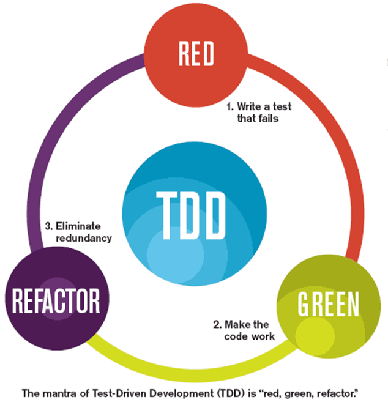
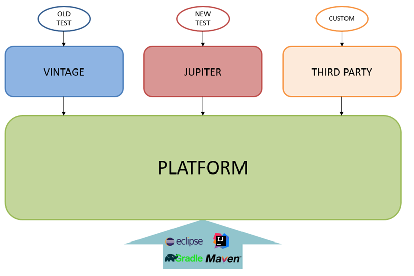

# Unit Testing 2022

## Test Driven Development

* Testing is cool 
* Testing makes Your life easier
* Testing makes You work faster
* Testing makes Your code better
* Unit testing vs. Integration Testing
* Write test then code
* Writing good tests is hard and takes practice

## Unit testing – F.I.R.S.T
### Fast
* milliseconds per test
* running after any change
* run multiple times in reasonable time
### Isolated
* tests one thing/feature
* clear error message
* no dependencies with external resources     (files/databases)
* has no influence on other tests
### Repeatable
* the same result every time
* no initial state
* running order has no impact on results
### Self-validating
* gives simple answer: test passes vs test fails
* no need to do additional results analysis 
### Timely
* prepare in good time
* prepare just before start coding given feature (method)


## What supports (or not) unit testing
Structures that support testing | Anti-patterns for unit tests |
--- | --- | 
 composition over inheritance | singleton pattern
 small classes | final elements
 small methods | static methods
 dependency injections |
 using interfaces | 

## JUnit Syntax Example
````
@Test
public void shouldAddTwoNumbers() {
  //given
  Calculator sut = new Calculator();
  //when
  int actual = sut.add(1, 2);
  //then
  assertEquals(3, actual);
}
````

## JUnit Initialization and Cleaning
````
class StandardTests {

    @BeforeAll
    static void initAll() {
    }

    @BeforeEach
    void init() {
    }

    @Test
    void succeedingTest() {
    }

    @Test
    void failingTest() {
        fail("a failing test");
    }

    @Test
    @Disabled("for demonstration purposes")
    void skippedTest() {
        // not executed
    }

    @Test
    void abortedTest() {
        assumeTrue("abc".contains("Z"));
        fail("test should have been aborted");
    }

    @AfterEach
    void tearDown() {
    }

    @AfterAll
    static void tearDownAll() {
    }
}
````

## JUnit API
### Assertions
* `assertEquals`
* `assertTrue`
* `assertFalse`
* `assertNull`
* `assertNotNull`
* `assertThrow`
* `assertAll`
* `assertTimeout`
### Assumptions
* `assumeTrue`
* `assumeFalse`
* `assumingThat`
### Parametrization
* `@ParametrizedTest`
    * `@ValueSource`
    * `@CsvSource`
    * `@CsvFileSource`
    * `@MethodSource`
### On/Off
* `@Disabled`
* `@EnabledOnJre`
* `@EnabledOnOs`


## JUnit - drawbacks
* poor implementation – just basic verification
* sometimes, there is a need to add own logic
* `(expected, actual)` or `(actual, expected)`

## Junit - modularity
* JUnit 5 is not a library, it is a framework!
  * JUNIT 5 = PLATFORM + JUPITER + VINTAGE
* JUnit Platform
  * Foundation for launching testing frameworks on the JVM
  * Launcher and TestEngine APIs
  * ConsoleLauncher, Gradle plugin, Maven Surefire provider
* JUnit Jupiter
  * New programming model and extension API for JUnit 5
* JUnit Vintage
  * TestEngines for running JUnit 3 and 4



Reference - read more: https://junit.org/junit5/docs/current/user-guide/#overview

## Samples

## Zadania
