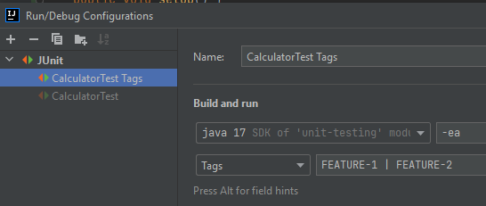

# Presentation Samples
## Init test
* `@Test`
* `@DisplayName`
````java
@DisplayName("Calculator test suite")
class CalculatorTest {
    
    @DisplayName(" Should add two numbers")
    @Test
    public void shouldAddTwoNumbers() {
        //given
        Calculator sut = new Calculator();
        //when
        int actual = sut.add(5, 7);
        //then
        assertEquals(12, actual);
    }
}
````

## Init structure
* `@BeforeAll`
* `@BeforeEach`
* `@AfterEach`
* `@AfterAll`
````java
@DisplayName("Calculator test suite")
class CalculatorTest {

    Calculator sut;
    static long startTime;

    @BeforeAll
    public static void initAll() {
        startTime = System.currentTimeMillis();
    }

    @BeforeEach
    public void setUp() {
        sut = new Calculator();
    }

    @DisplayName(" Should add two numbers")
    @Test
    public void shouldAddTwoNumbers() {
        //given
        //when
        int actual = sut.add(5, 7);
        //then
        assertEquals(12, actual);
    }

    @AfterAll
    public static void tearDownAll() {
        long endTime = System.currentTimeMillis();
        System.out.println("exe time: " + (endTime - startTime) + " ms.");
    }
}
````

## Assertions
* `assertEquals()`
* `assertTrue()` & `assertFalse()`
    ```java
      @Test
      public void shouldCheckPrime(){
        assertTrue(sut.isPrime(7));
        assertFalse(sut.isPrime(8));
      }
    ```
* `assertNull()`
    ```java
    @Test
    public void shouldCheckNull() {
        assertNotNull(sut, " should check null");
    }
    ```
* `assertNotNull()`
* `assertAll()`
    ```java
    @Test
    public void shouldAddAllNumbers() {
        assertAll(
                () -> assertEquals(6, sut.add(2,4)),
                () -> assertEquals(10, sut.add(5,5))
        );
    }
    ```
* `assertTimeout()`
  ```java
    @Test
    public void shouldBeExecutedFast() {
        assertTimeout(Duration.ofMillis(10), () -> sut.multiply(50, 60));
    }
  ```
* `assertThrow()`
    ```java
    @Test
    public void shouldThrownException() {
        NotDividedByZeroException notDividedByZeroException = assertThrows(NotDividedByZeroException.class, () -> sut.divide(4, 0));
        assertEquals("Can't by zero!" , notDividedByZeroException.getMessage());
    }
    ```

## Disabling Tests

```java
@Disabled("Disabled until bug #99 has been fixed")
class DisabledClassDemo {

  @Test
  @Disabled
  void testWillBeSkipped() {
  }
}
```

## Conditional Test Executing
(i) run whole test suite!
### Operating System
```java
@Test
@EnabledOnOs(OS.MAC)
public void shouldCheckPrime(){

    assertTrue(sut.isPrime(7));
    assertFalse(sut.isPrime(8));
}
```
### Java Runtime Environment
```java
    @Test
    @EnabledOnJre(JAVA_14)
    public void shouldCheckPrime(){

        assertTrue(sut.isPrime(7));
        assertFalse(sut.isPrime(8));
    }

    @Test
    @EnabledForJreRange(min = JAVA_8, max = JAVA_11)
    public void shouldCheckNull() {
        assertNotNull(sut, " should check null");
    }
```
### System or Environment Variables
```java
@Test
@EnabledIfSystemProperty(named = "os.arch", matches = ".*64.*")
void onlyOn64BitArchitectures() {
    // ...
}
```
### Custom
```java
@Test
@EnabledIf("customCondition")
void enabled() {
    assertEquals(7, sut.add(2,5));
}

boolean customCondition() {
    return Month.MARCH == LocalDateTime.now().getMonth();
}
```

## Tagging
```java
class CalculatorTest {
    
    Calculator sut;

    @BeforeEach
    public void setUp() {
        sut = new Calculator();
    }

    @Test
    @Tag("FEATURE-1")
    public void shouldDivideNumbers() throws NotDividedByZeroException {
        assertEquals(5, sut.divide(25, 5));
    }

    @Test
    @Tag("FEATURE-2")
    public void shouldSubtract() {
        assertEquals(3, sut.subtract(10, 7));
    }

    @Test
    public void shouldCheckPrime() {
        assertTrue(sut.isPrime(17));
    }
}
```

### IntelliJ config


### Maven config
```xml
<plugin>
  <artifactId>maven-surefire-plugin</artifactId>
  <version>${maven.surefire.plugin.version}</version>
  <configuration>
      <includes>
          <include>**/Test*.java</include>
          <include>**/*Test.java</include>
          <include>**/*Tests.java</include>
          <include>**/*TestCase.java</include>
      </includes>
      <excludedGroups>FEATURE-1</excludedGroups>
  </configuration>
</plugin>
```

## Parametrized Tests
```java
@DisplayName("Parametrized tests for basic calculus")
public class CalculatorParametrizedTest {

    Calculator sut;

    @BeforeEach
    void setUp() {
        sut = new Calculator();
    }

    @ParameterizedTest
    @ValueSource(ints = {5, 10, 15, 9})
    void whenIsDividedBy5(int a) {
        assertEquals(0, sut.modulo(a, 5));
    }

    @ParameterizedTest
    @CsvSource({"25,5", "9,3", "28, 4", "17, 16"})
    @DisplayName("for checking divisibility")
    void isDivisible(int a, int b) {
        assertEquals(0, sut.modulo(a, b));
    }

    @ParameterizedTest
    @MethodSource("first10PrimesProvider")
    void isPrime(int prime) {
        assertTrue(sut.isPrime(prime));
    }

    static Stream<Integer> first10PrimesProvider() {
        return Stream.of(2, 3, 5, 7, 11, 13, 17, 19, 23, 28);
    }

    @ParameterizedTest
    @CsvFileSource(resources = "/ABsum.csv", numLinesToSkip = 1, delimiter = ';')
    @DisplayName("When adding multiple numbers from external file")
    void testWhenAddingMultipleNumbersFromExternalFile(int a, int b, int sum) {
        assertEquals(sum, sut.add(a, b));
    }
}
```
## Nesting
```java
class StackExerciseTest {

    StackExercise stack;

    @Test
    @DisplayName("is instantiated with new Stack")
    void isInstantiatedWithNew() {
        stack = new StackExercise();
    }

    @Nested
    @DisplayName("when new")
    class WhenNew {

        @BeforeEach
        void createNewStack() {
            stack = new StackExercise();
        }

        @Test
        @DisplayName("is empty")
        void isEmpty() {
            assertTrue(stack.isEmpty());
        }

        @Test
        @DisplayName("throws EmptyStackException when popped")
        void throwsExceptionWhenPopped() {
            assertThrows(StackEmptyException.class, stack::pop);
        }

        @Nested
        @DisplayName("after pushing an element")
        class AfterPushing {

            String anElement = "an element";

            @BeforeEach
            void pushAnElement() {
                stack.push(anElement);
            }

            @Test
            @DisplayName("it is no longer empty")
            void isNotEmpty() {
                assertFalse(stack.isEmpty());
            }

            @Test
            @DisplayName("returns the element when popped and is empty")
            void returnElementWhenPopped() throws StackEmptyException {
                assertEquals(anElement, stack.pop());
                assertTrue(stack.isEmpty());
            }
        }
    }
}
```

##  Test Execution Order
* Method Order
* Class Order

### Method Order
```java
//@TestMethodOrder(MethodOrderer.DisplayName.class)
@TestMethodOrder(MethodOrderer.OrderAnnotation.class)
class CalculatorTest {

    Calculator sut;

    @BeforeEach
    public void setUp() {
        sut = new Calculator();
    }

    @Test
    @Order(100)
    public void shouldDivideNumbers() throws NotDividedByZeroException {
        assertEquals(5, sut.divide(25, 5));
    }

    @Test
    @Order(300)
    public void shouldSubtract() {
        assertEquals(3, sut.subtract(10, 7));
    }

    @Test
    @Order(200)
    public void shouldCheckPrime() {
        assertTrue(sut.isPrime(17));
    }
}
```

## Repeated
```java
@RepeatedTest(10)
//@RepeatedTest(value = 5, name = "{displayName} {currentRepetition}/{totalRepetitions}")
public void shouldSubtract() {
    assertEquals(3, sut.subtract(10, 7));
}
```

## Running legacy tests 
```xml
<dependency>
    <groupId>junit</groupId>
    <artifactId>junit</artifactId>
    <version>${junit.version}</version>
    <scope>test</scope>
</dependency>
<dependency>
    <groupId>org.junit.vintage</groupId>
    <artifactId>junit-vintage-engine</artifactId>
    <version>${junit.vintage.version}</version>
    <scope>test</scope>
</dependency>
```

## Generating report
```bash
mvn clean verify surefire-report:report
```